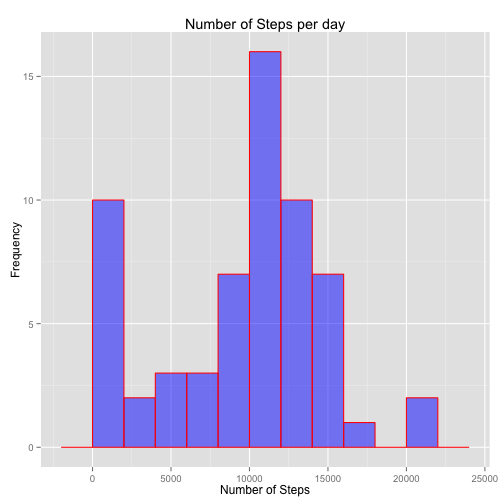
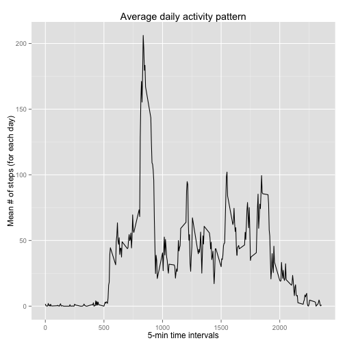
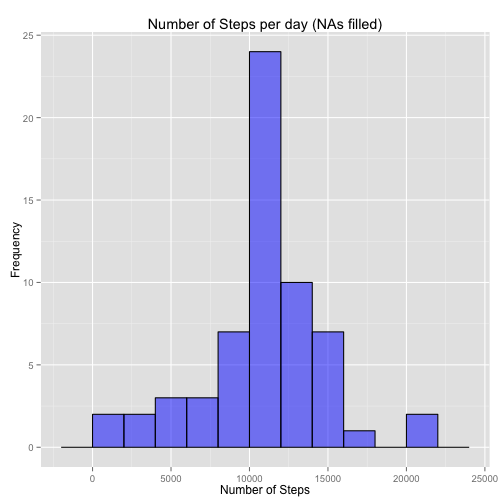
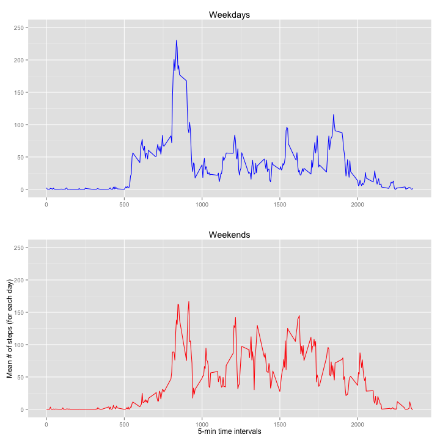

# Reproducible research - Project 1

&nbsp;

> Technical note: ggplot2 and gridExtra libraries are required

&nbsp;
&nbsp;

## 1. Loading data

&nbsp;

#### First, we load the data. No need for preprocessing


```r
library(ggplot2)
data <- read.csv('activity.csv',header=TRUE)
```
&nbsp;
&nbsp;

## 2. What is mean total number of steps taken per day?

&nbsp;


```r
countSteps <- tapply(data$steps, data$date, sum, na.rm = TRUE)
meanSteps  <- mean(countSteps)
medianSteps <- median(countSteps)
qplot(countSteps, geom="histogram",
       binwidth=2000, main = "Number of Steps per day",
       fill = I("blue"), xlab = "Number of Steps", ylab = "Frequency",
       col=I("red"), alpha=I(.5))
```


#### Steps per day: Mean = 9354.2295082,  Median = 10395

&nbsp;
&nbsp;

## 3. What is the average daily activity pattern?

&nbsp;

#### For each 5-minutes interval, mean number of steps per each day is calculated

```r
dayActiv <- tapply(data$steps, data$interval, mean, na.rm = TRUE)
x <- unique(data$interval)
df <- data.frame(x,dayActiv)
maxSteps <- max(df[,2])
bestInterval <- df[df[,2]==maxSteps,1]
ggplot(df, aes(x)) + 
        geom_line(aes(y=dayActiv),colour='black')+
        xlab("5-min time intervals") + 
        ylab("Mean # of steps (for each day)")+
        ggtitle("Average daily activity pattern")
```




#### 5-minutes time interval containing maximum number of steps: 835 (206.1698113 steps). 

&nbsp;
&nbsp;

## 4. Imputing missing values

&nbsp;

#### Find all NA values in the dataset


```r
totNAns <- sum(is.na(data))
```
Number of missing values in the dataset = 2304

#### In order to fill NAs, we can use average values for corresponding 5-minutes intervals.
  

```r
repParam <- length(data$interval)/length(dayActiv)
dayActiv_rep <- rep(dayActiv, times=repParam)
newData <- data.frame(data,dayActiv_rep)
newData[is.na(newData[,'steps']),'steps'] = newData[is.na(newData[,'steps']),'dayActiv_rep']
```

#### Now we can plot the histogram and calculate mean and median, like in section 1


```r
countSteps_fill <- tapply(newData$steps, newData$date, sum, na.rm = TRUE)
meanSteps_fill  <- mean(countSteps_fill)
medianSteps_fill <- median(countSteps_fill)
qplot(countSteps_fill, geom="histogram",
       binwidth=2000, main = "Number of Steps per day (NAs filled)",
       fill = I("blue"), xlab = "Number of Steps", ylab = "Frequency",
       col=I("black"), alpha=I(.5))
```


#### Steps per day: Mean = 1.0766189 &times; 10<sup>4</sup>,  Median = 1.0766189 &times; 10<sup>4</sup>
#### Mean and Median are now equal and slightly higher. It may be interesting to see how different substitution strategies for missing values affect the final result 

&nbsp;
&nbsp;

## 5. Are there differences in activity patterns between weekdays and weekends?

&nbsp;

#### We set Rstudio in such a way that weekdays will be printed in english

```r
Sys.setlocale("LC_TIME", "en_US")
```

```
## [1] "en_US"
```

```r
weekdays(Sys.Date()+0:6)
```

```
## [1] "Sunday"    "Monday"    "Tuesday"   "Wednesday" "Thursday"  "Friday"   
## [7] "Saturday"
```

#### Then simply classify days in weekday and weekend

```r
days_from_data <- weekdays(as.Date(newData$date))
weekdays <- c("Monday","Tuesday","Wednesday","Thursday","Friday")
whichDay <- factor(days_from_data %in% weekdays)
levels(whichDay)[levels(whichDay) == "FALSE"] <- "weekend"
levels(whichDay)[levels(whichDay) == "TRUE"] <- "weekday"
newData <- data.frame(newData,whichDay)
```

#### Panel plot comparing weekdays and weekends

```r
library(gridExtra)
dataWeekDay <- newData[newData["whichDay"]=="weekday",]
dataWeekEnd <- newData[newData["whichDay"]=="weekend",]
dweek_Activ <- tapply(dataWeekDay$steps, dataWeekDay$interval, mean)
dend_Activ <- tapply(dataWeekEnd$steps, dataWeekEnd$interval, mean)
df_week <- data.frame(x,dweek_Activ)
df_end <- data.frame(x,dend_Activ)
g1 <- ggplot(df, aes(x)) + 
        geom_line(aes(y=dweek_Activ),colour='blue')+
        xlab("")+ ylab("")+
        ylim(0, 250)+
        ggtitle("Weekdays")
g2 <- ggplot(df_end, aes(x)) + 
        geom_line(aes(y=dend_Activ),colour='red')+
        xlab("5-min time intervals") + 
        ylab("Mean # of steps (for each day)")+
        ylim(0, 250)+
        ggtitle("Weekends")  
grid.arrange(g1, g2)
```


  


